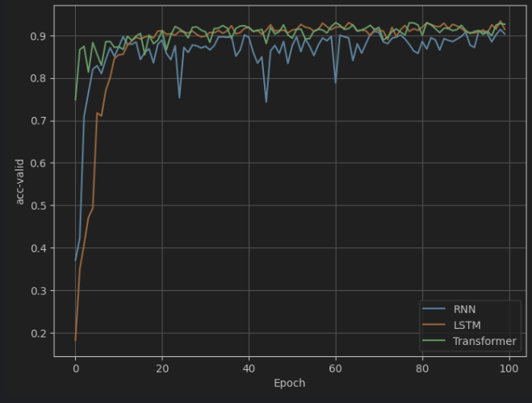

### Design and Train the **RNN**, **LSTM** and **Transformer** models with HAR Dataset and compare to each other

The **HAR Dataset** (Human Activity Recognition) is a widely-used dataset in the field of activity recognition. It is
most
commonly referred to as the UCI HAR Dataset, published by the University of California, Irvine (UCI).

## 📊 Dataset Overview

- **Source:** UCI Machine Learning Repository
- **Devices:** Samsung Galaxy S II smartphone
- **Sensors:** Accelerometer & Gyroscope
- **Sampling Rate:** 50 Hz
- **Subjects:** 30 volunteers (age 19–48)

### 🎯 Goal

To predict one of six activities performed by a person, based on sensor data collected from a smartphone.

---

## 🧍 Activities (Target Classes)

| Label | Activity           |
|-------|--------------------|
| 1     | Walking            |
| 2     | Walking Upstairs   |
| 3     | Walking Downstairs |
| 4     | Sitting            |
| 5     | Standing           |
| 6     | Laying             |

🔹 Use Cases:
This dataset is frequently used in machine learning, deep learning, signal processing, and health monitoring
applications, especially for recognizing human daily activities to support smart healthcare, fitness tracking, and
elderly care.

---

* Loss function: CrossEntropyLoss
* Optimizer: SGD
* Momentum: 0.9

## Selected the best Larning rate and the wight decay

* RNN:
    - Larning rate: 0.25
    - Weight decay: 1e-6
* LSTM:
    - Larning rate: 0.3
    - Weight decay: 1e-4
* Transformer:
    - Larning rate: 0.1
    - Weight decay: 1e-5

## Compare the results:

### Loss Train:

### Loss Valid:

### Accuracy Train:

### Accuracy Valid:

